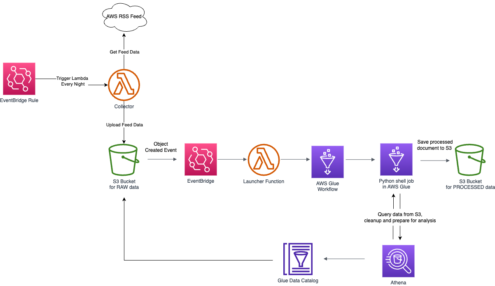

## About
This project is used to collect and process AWS RSS Feed data. The data is then stored in S3 in a tabular format and available for analysis.

## Solution overview
The solution is composed of the following components:
- AWS Lambda collector function, that is triggered by an EventBridge Rule every night and collects the RSS Feed data from AWS and stores it in S3 landing bucket
- AWS Glue table in the AWS Glue Data Catalog that pointed to the S3 landing bucket
- AWS Athena query engine that allows to query the data in S3
- AWS Glue Python shell job that processes the data, query Athena and stores results in a tabular format in S3 for processed data.

## Prerequisites
- S3 bucket for landing and processed data
- SNS topic ARN for notifications
- Lamda Layer version for Python dependencies
## Deployment
The data collection and processing capabilities are separated using two different CloudFormation stacks and deployed invididually by using the AWS Cloud Development Kit. 

### Deploy collector stack
Follow instructions in the [collector/README.md](collector/README.md) file.

### Deploy processing stack
Follow instructions in the [processor/README.md](processor/README.md) file.

## Summary

Once deployed you will receive an email notification with the link to the consolidate report that would contain all records from the RSS Feed. You can you this data for visual analysis or further processing.

Enjoy!

