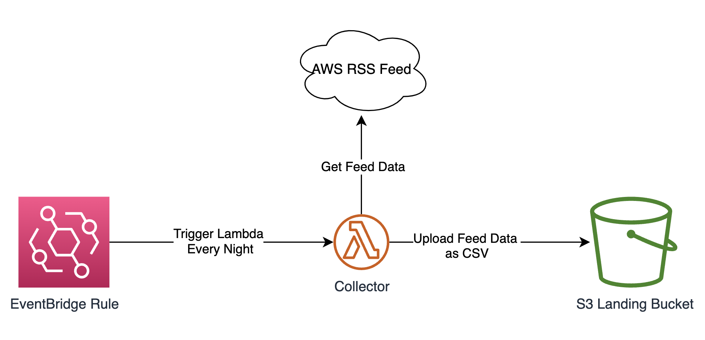

## About
This project is used to deploy Lambda function that collects data from AWS RSS Feed and stores it in S3 bucket in a tabular format.
Lambda function is triggered by Evenbridge Rule that is scheduled to run every day.



## Prerequisites
This project requires the following (add them to the `cdk.context.json` file):
- AWS Feed RSS URL
- SNS topic to send notifications
- S3 bucket to store raw data
- Two Lambda Layers:
    - feedparser (arn:aws:lambda:us-east-1:419091122511:layer:feedparser:2)
    - pandas (arn:aws:lambda:us-east-1:336392948345:layer:AWSSDKPandas-Python39:1)


## Installing dependencies

```
python3 -m venv .venv
source .venv/bin/activate
pip install -r requirements.txt
```

## Testing Lambda function locally

```
$ bash tests/test_local.sh
```

## Deploy function
```
cdk deploy
```

## Useful commands

 * `cdk ls`          list all stacks in the app
 * `cdk synth`       emits the synthesized CloudFormation template
 * `cdk deploy`      deploy this stack to your default AWS account/region
 * `cdk diff`        compare deployed stack with current state
 * `cdk docs`        open CDK documentation

Enjoy!
