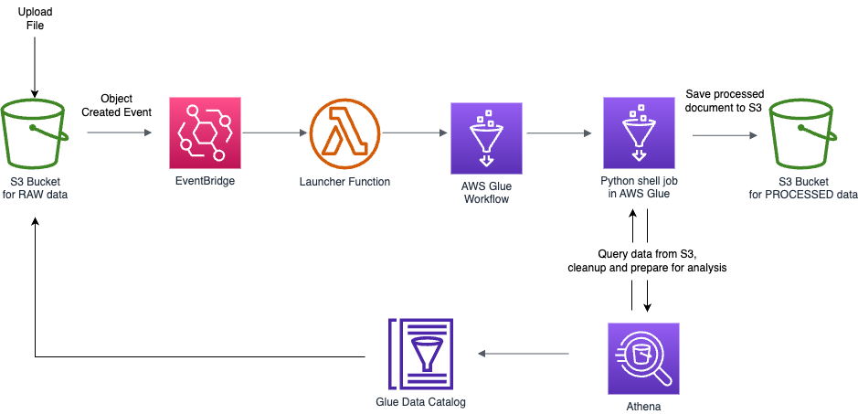

## About
This solution is used to process RSS Feed Data stored in a landing s3 bucket. It uses Athena and Glue Shell Job to consolidate the data into a single file, cleanup the resulting file, add additional columns, and then store report in a reporting s3 bucket. It is triggered once a new file uploaded to the S3 landing bucket. Once finished, you will receive an email notification with the results.



## Prerequisites
To manually create a virtualenv on MacOS and Linux:

```
$ python3 -m venv .venv
$ source .venv/bin/activate
$ pip install -r requirements.txt
```


At this point you can now synthesize the CloudFormation template for this code.

```
$ cdk synth
```

## Deploy
To deploy your stack to AWS, run the following command:

```
$ cdk deploy
```

To add additional dependencies, for example other CDK libraries, just add
them to your `setup.py` file and rerun the `pip install -r requirements.txt`
command.

## Useful commands

 * `cdk ls`          list all stacks in the app
 * `cdk synth`       emits the synthesized CloudFormation template
 * `cdk deploy`      deploy this stack to your default AWS account/region
 * `cdk diff`        compare deployed stack with current state
 * `cdk docs`        open CDK documentation

Enjoy!
